# 基于Springboot的在线商城系统

## Springboot-0034


## 技术栈

Springboot mybatisplus vue mysql maven


## 数据库表(14张)


## 功能介绍

```properties
管理员:商品管理,商品分类管理,订单管理,用户管理,
用户:登录注册,商品查看,购买,个人资料修改,在线咨询
```


## 图片

### 前台


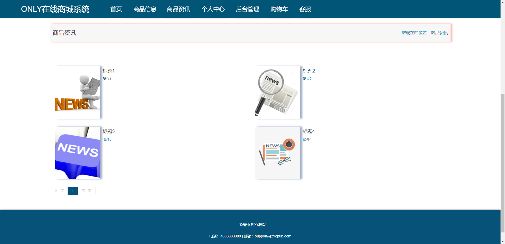


### 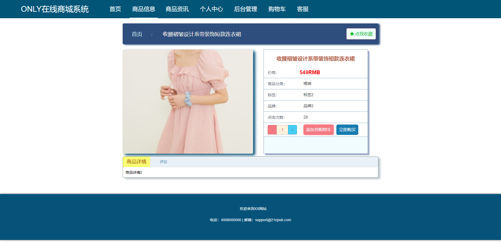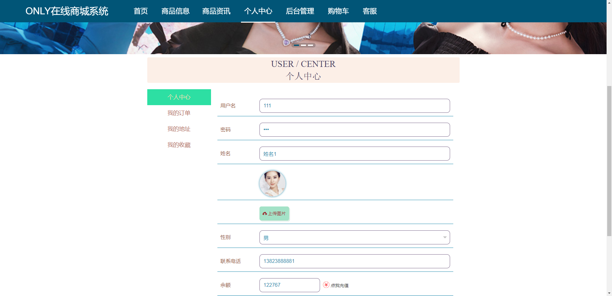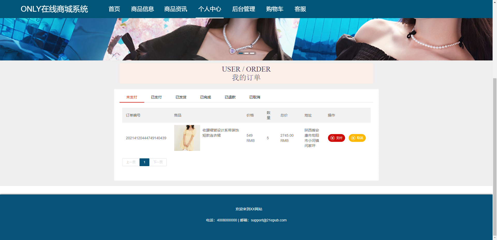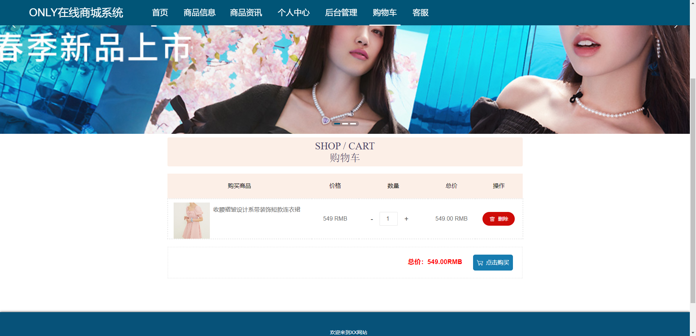

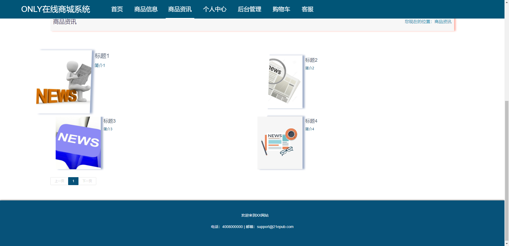

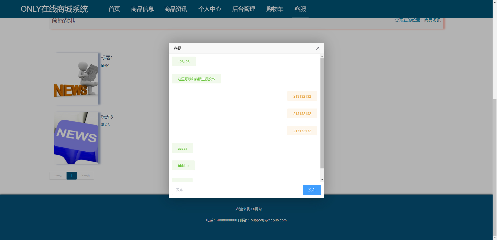

### 后台

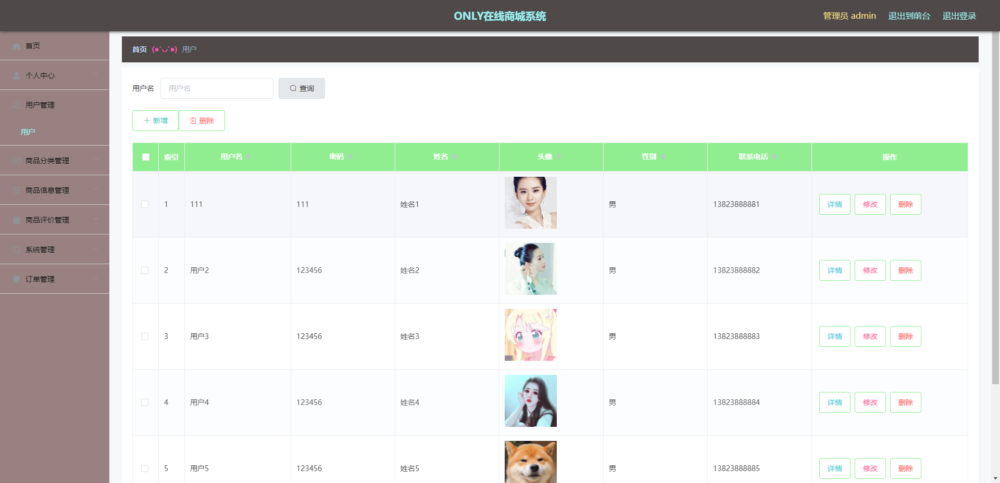

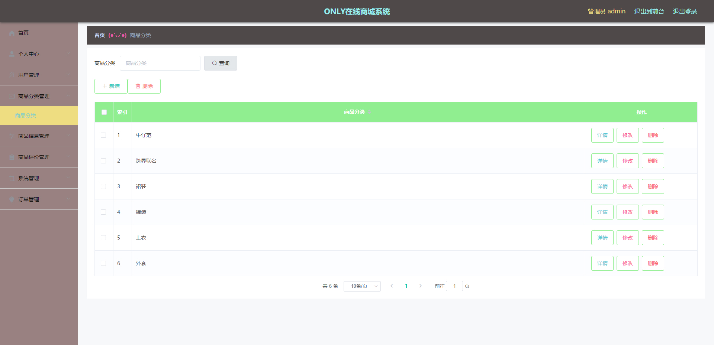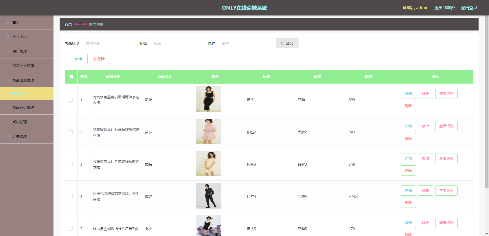


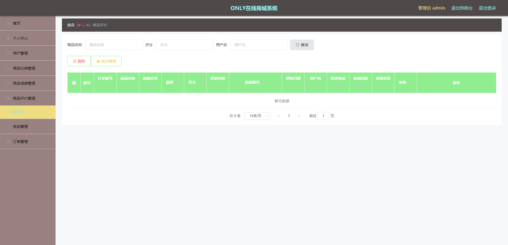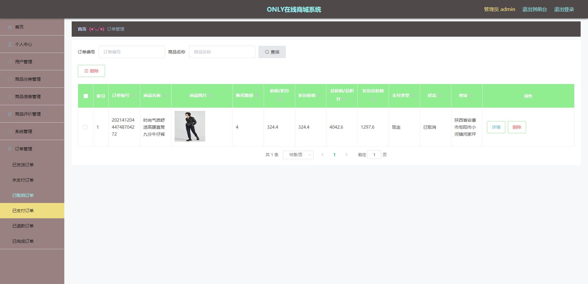

## 访问路径

### 前台

```properties
http://localhost:8080/ONLYzaixianshangcheng/front/pages/login/login.html

账号 111
密码 111
```

### 后台

```properties
http://localhost:8080/ONLYzaixianshangcheng/admin/dist/index.html#/login

账号 admin
密码 admin
```


## 功能图

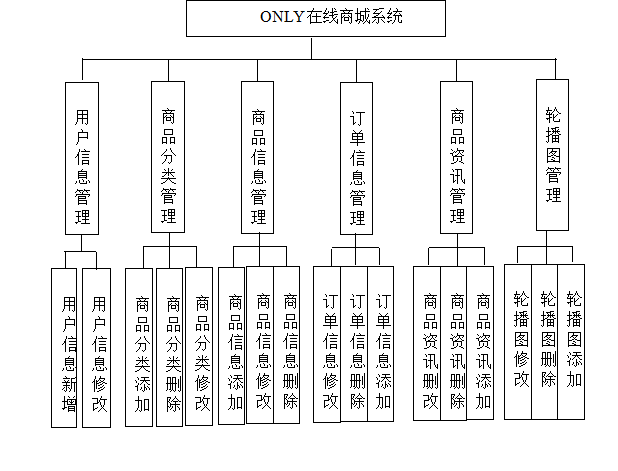


## 文档目录

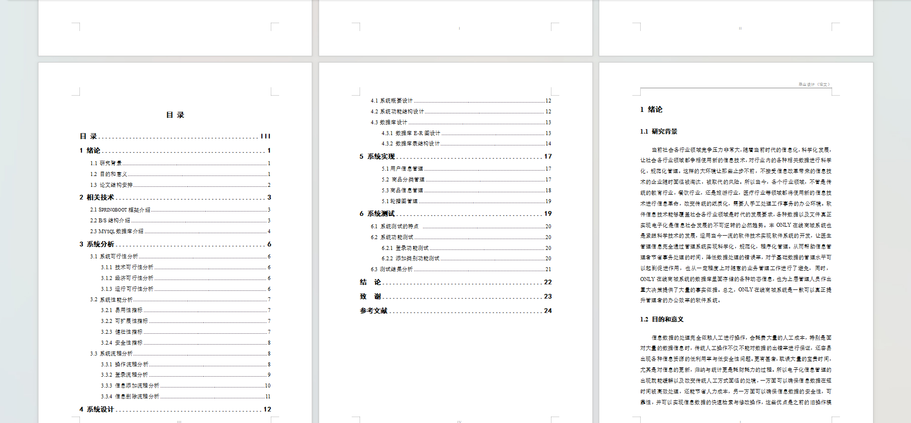


## 打赏或交流


